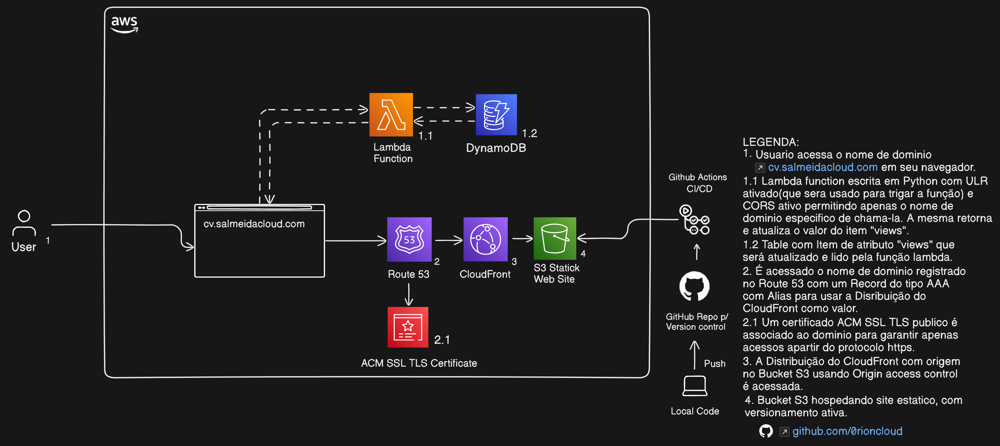
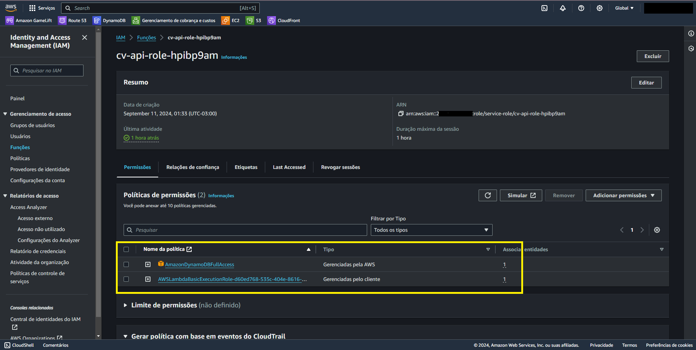

# AWS CLOUD RESUME CHALLENGE

## Descrição
Este é o meu projeto para a conclusão do [AWS Cloud Resume Challenge](https://cloudresumechallenge.dev/). O que é o Cloud Resume Challenge? É um projeto com múltiplas etapas que tem como objetivo hospedar um website como se fosse seu currículo.

Existem alguns requisitos para a conclusão do desafio, entre eles estão:
- Construção de um site em HTML e CSS (um template pode ser usado para os menos experientes em desenvolvimento web).
- Hospedagem de um site estático usando Amazon S3.
- Implementação de uma URL usando apenas HTTPS.
- Apontar a URL para um domínio personalizado.
- O site deve mostrar a quantidade de visitantes que já o acessaram.
- Um banco de dados para armazenar a quantidade de vezes que o site foi visitado.
- Comunicação do site com o banco de dados através de uma API.
- Utilização de IaC (Infraestrutura como Código) para o Back-End.
- Uso de uma ferramenta de controle de versão para gerenciar o código.
- Implementação de CI/CD para aplicar mudanças de forma dinâmica.

Alguns links serão adicionados para esclarecer os serviços e funcionalidades utilizadas.

## Arquitetura

## Serviços e Tecnologias Utilizados
- **S3**
- **CloudFront**
- **ACM**
- **DynamoDB**
- **Lambda**
- **Terraform**
- **GitHub Actions**
- **HTML, CSS e JavaScript**

## [Resultado Final](https://cv.salmeidacloud.com)

# 1. Construção do HTML e CSS
O HTML e CSS foram feitos com base em um template para facilitar a construção do projeto. Você pode encontrar diversos templates na página clicando [aqui](https://www.free-css.com/template-categories/portfolio). Usando um template ou não, basta adicionar suas informações e atualizar o CSS conforme desejado. Com o HTML e CSS personalizados, podemos seguir para a próxima etapa.

# 2. Hospedagem de Site Estático no S3
Com os arquivos prontos, foi criado um bucket [S3](https://aws.amazon.com/pt/s3/) e feito o upload de todos os arquivos do projeto. Em propriedades, foi ativada a funcionalidade de site estático e definido o arquivo `index.html` como o objeto raiz. Também foram adicionadas funcionalidades como [versionamento](https://docs.aws.amazon.com/pt_br/AmazonS3/latest/userguide/Versioning.html) e uma [lifecycle policy](https://docs.aws.amazon.com/AmazonS3/latest/userguide/object-lifecycle-mgmt.html) para gerenciar versões de arquivos (opcional). Com isso, foi gerada uma URL para acesso ao site. No entanto, será necessário configurar permissões públicas no bucket, que serão resolvidas no próximo passo.

# 3. Implementação de uma URL usando apenas HTTPS
Para termos apenas HTTPS como protocolo para o site, foi necessário configurar uma distribuição do [CloudFront](https://aws.amazon.com/pt/cloudfront/). Ao criar a distribuição, foi utilizado o bucket S3 como o Origin. A configuração de acesso ao Origin foi feita usando as **Origin Access Control Settings** com uma política de bucket gerada pelo próprio CloudFront, garantindo acesso seguro ao bucket.

# 4. Domínio Personalizado para o Site
O [Route 53](https://aws.amazon.com/pt/route53/) foi utilizado para registrar e gerenciar um domínio personalizado para acessar o site. Com o domínio registrado e nossa hosted zone pronta, foi possível gerenciar o DNS criando um recorde do tipo A com **Alias** ativado apontando para a distribuição do CloudFront.

## 4.1 ACM para encryptação em transito
Utilizando o [ACM](https://aws.amazon.com/pt/certificate-manager/), foi gerado um certificado público SSL/TLS para garantir a criptografia do tráfego. A distribuição do CloudFront foi então atualizada para incluir o nome de domínio e um **default root object** (`index.html`), desativando o acesso público ao bucket e permitindo apenas conexões seguras.

# 5. Contagem de Visitantes
Para desenvolver essa funcionalidade, foi necessário usar um pouco de [JavaScript](https://www.javascript.com/), [DynamoDB](https://aws.amazon.com/pt/dynamodb/) e [AWS Lambda](https://aws.amazon.com/pt/lambda/). A contagem de visitantes foi implementada usando um banco de dados, uma [API](https://aws.amazon.com/pt/what-is/api/) para comunicação e uma função JavaScript para buscar os dados e exibir a quantidade de visitantes no site.

## 5.1 Banco de Dados
Foi criado um banco de dados [NoSQL](https://aws.amazon.com/pt/nosql/) utilizando DynamoDB com uma tabela contendo um item com o atributo `"views"` e valor inicial `1`. A tabela é atualizada e consultada pela nossa API.

## 5.2 API de Comunicação com o Banco de Dados
Uma função Lambda foi desenvolvida em Python para buscar o item no banco de dados, somar `1` ao valor de `views` e atualizá-lo no DynamoDB, retornando o valor atualizado. A função foi exposta como uma **Function URL** para criar um endpoint HTTP, com configuração de [CORS](https://aws.amazon.com/pt/what-is/cross-origin-resource-sharing/) para permitir apenas o domínio personalizado. A função também utiliza uma [IAM Role](https://docs.aws.amazon.com/IAM/latest/UserGuide/id_roles.html) para garantir acesso seguro ao DynamoDB.

## 5.3 Função JavaScript
Foi implementada uma função `fetch` no arquivo `resume.min.js` (ou `index.js` como alternativa) para buscar o valor de `views` através da URL da Lambda. A função exibe a contagem de visitantes e, em caso de erro, exibe uma mensagem personalizada. O arquivo JS foi referenciado no `index.html` para exibição dos dados.

# 6. IaC para o Back-End
[Terraform](https://www.terraform.io/) foi a tecnologia escolhida para criar a infraestrutura como código. Utilizando a [documentação oficial](https://registry.terraform.io/providers/hashicorp/aws/latest/docs), foi possível criar todo o código necessário para configurar o DynamoDB, a Lambda e suas integrações de maneira automatizada. Com essa abordagem, é possível provisionar a infraestrutura com um único comando.

# 7. Versionamento e CI/CD
O controle de versão do projeto foi feito utilizando [GIT](https://git-scm.com/) e [GitHub](https://github.com/). Foi criado um repositório para gerenciar o código, além de usar o [GitHub Actions](https://github.com/features/actions) para construir pipelines de CI/CD. No repositório, foram configurados [segredos](https://docs.github.com/pt/actions/security-guides/using-secrets-in-github-actions) para permitir acesso seguro à conta da AWS. Utilizando [S3 Sync](https://github.com/marketplace/actions/s3-sync), foi configurada uma pipeline para atualizar automaticamente o conteúdo do bucket sempre que o código no repositório for atualizado.

## Conclusão

O projeto está ativo e disponível para acesso [aqui](https://cv.salmeidacloud.com/). A implementação deste currículo digital na nuvem foi um desafio enriquecedor, que permitiu a aplicação prática de diversos conceitos de computação em nuvem, desenvolvimento web e integração com serviços da AWS. A utilização de uma arquitetura baseada em **S3**, **Lambda Functions** e **DynamoDB** trouxe uma camada extra de complexidade e aprendizado, especialmente no que diz respeito ao gerenciamento e persistência de dados dinâmicos no back-end.
Durante o desenvolvimento, explorei a integração com banco de dados para adicionar funcionalidades que não seriam possíveis em um site estático tradicional, como a contagem dinâmica de visitantes e a atualização em tempo real dos dados de perfil. 

Este projeto pode ser expandido de várias formas, como por exemplo, a inclusão de **Infraestrutura como Código (IaC)** para a automatização completa do ambiente de front-end, o que facilitaria o gerenciamento e a replicação do ambiente em diferentes regiões.
Outra possibilidade seria transformar este site em um portal pessoal mais completo, que agregue um blog técnico, um portfólio visual e outras páginas informativas, promovendo uma visão mais ampla das minhas habilidades e projetos.
